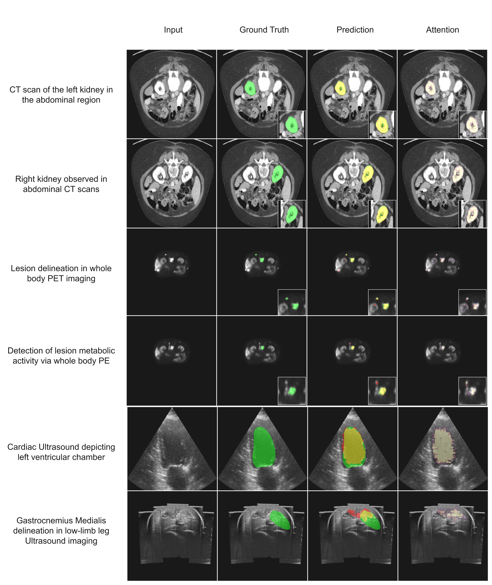
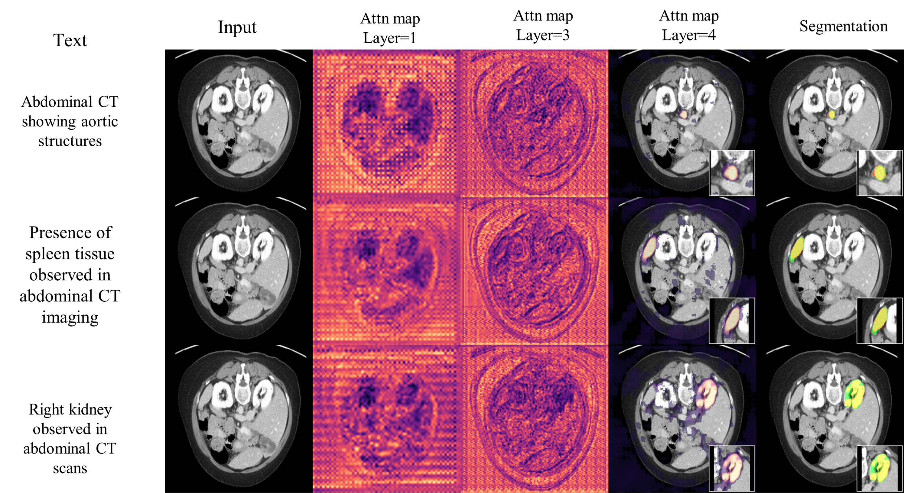

# Text-MedSAM: Text-Guided Medical Image Segmentation

A text-guided medical image segmentation framework built on the MedSAM architecture. This repository implements medical image segmentation using natural language prompts combined with efficient vision transformers and biomedical text encoders.

## Overview

Text-MedSAM extends the Segment Anything Model (SAM) for medical imaging by incorporating text prompts as guidance for segmentation tasks. The framework leverages:

- **Efficient Image Encoding**: RepViT-based encoder for fast visual feature extraction
- **Medical Text Encoding**: PubMedBERT for domain-specific biomedical text understanding
- **Adaptive Text-Image Fusion**: Token shuffling and channel unshuffling for seamless modality integration
- **Multi-Modal Attention**: Cross-modal attention mechanisms for text-guided segmentation


### Key Features

- ✅ Text-guided segmentation of medical images (CT, MRI, PET, etc.)
- ✅ Distributed Data Parallel (DDP) training on multi-GPU systems
- ✅ Efficient inference with optimized model architecture

---

## Visualization
<picture>
  <source media="(prefers-color-scheme: dark)" srcset="assets/segs_clip_dark.png">
  <source media="(prefers-color-scheme: light)" srcset="assets/segs_clip.png">
  
</picture>
<p align="center" style="color: #333333; font-size: 14px;">
  Visualization of segmentation and attention map of the last layer, where green overlays represent the ground truth mask, yellow indicates the predicted segmentation, and red/heat intensity highlights the model's focus area.
</p>

<br><hr><br>

<picture>
  
</picture>
<p align="center" style="color: #333333; font-size: 14px;">
  Visualization of intermediate feature maps and final segmentation results, illustrating how the model progressively suppresses background noise and focuses on the target anatomical structures.
</p>

## Repository Structure
```
Text-MedSAM/
├── src/
│   ├── dataset/
│   │   ├── textseg.py            # Text-guided segmentation dataset
│   │   └── utils.py              # Data processing utilities
│   ├── models/
│   │   ├── shuffle_former.py     # ShuffleFormer: Text-image fusion architecture
│   │   ├── transformer.py        # Attention mechanisms
│   │   ├── modules.py            # Core building blocks
│   │   ├── visual/
│   │   │   └── image_encoder.py  # RepViT encoder
│   │   ├── heads/
│   │   │   └── text_embedder.py  # PubMedBERT text encoder
│   │   └── maskformer.py         # MaskFormer decoder
│   └── losses/
│       ├── total_loss.py         # Combined loss function
│       ├── medsam_loss.py        # Segmentation loss
│       └── clip_loss.py          # Text-image alignment loss
├── configs/
│   └── text_seg_repvit.yaml      # Training configuration
├── scripts/
│   ├── embeddings.sh             # DDP embedding generation
│   ├── text_predict.sh           # Batch inference
│   └── batch_infer_text.py       # Inference implementation
├── utils/
│   ├── utils.py                  # Training utilities
│   └── npz_to_npy.py            # Data format conversion
├── ckpts/                         # Model checkpoints
├── main.py                        # Lightning training framework
└── requirements.txt              # Dependencies
```

---

## Model Architecture
## Component Details

### 1. **Image Encoder: RepViT**
- **Input**: 256×256
- **Output**: 64×64×256 feature map (16× downsampling)
- **Efficiency**:
  - Parameters: ~6M (comparable to TinyViT)
  - Inference Latency: 0.36s per 256×256 image

---

### 2. **Text Encoder: PubMedBERT**
- **Vocabulary**: Medical and biomedical terminology
- **Configuration**:
  - Hidden Dimension: 768
  - Number of Layers: 12
  - Attention Heads: 12
  - Output Projection: 1024 (after final linear layer)

---

### 3. **Text-Image Fusion: ShuffleFormer**

**Purpose**: Seamlessly integrate visual and textual information for text-guided segmentation

**Architecture Overview**:

The ShuffleFormer implements a fusion strategy combining token shuffling, cross-modal attention, and learnable fusion:

#### **A. Token Shuffling (TokenShuffle)**

**Goal**: Reorganize spatial tokens to enable efficient multi-scale fusion

**Process**:
```
Input: Visual Features (B × 4096 × 256)  [64×64 flattened]
       where B = batch size

Step 1: MLP Projection
    ├─ Linear: 256 → 256 // (s²)
    │  [where s = shuffle_size, typically 2]
    │  Output: (B × 4096 × 64)
    └─ Creates reduced dimension for efficiency

Step 2: Spatial Rearrangement
    ├─ Input shape: (B × 4096 × 64)
    ├─ Rearrange to: (B × 1024 × 256)  [32×32 with 4× channels]
    ├─ Formula: "b (h s1 w s2) c -> b (h w) (c s1 s2)"
    │  where h=32, w=32, s1=2, s2=2
    └─ Aggregates local spatial information

Step 3: Fusion MLP (Optional)
    ├─ For each fusion block:
    │  └─ Linear: 256 → 256
    └─ Refines shuffled representation

Output: Fused Token Representation (B × 1024 × 256)
```

**Benefits**:
- Reduces computational complexity
- Groups spatially proximal tokens for local interaction
- Enables multi-scale feature fusion

---

#### **B. Transformer Blocks with Cross-Modal Attention**

**Goal**: Learn text-guided visual features through multi-head attention

**Architecture** (repeats `n_attn` times, typically 2):
```
Input: Visual Tokens (B × 1024 × 256)
       Text Embedding (B × 1 × 1024)

Step 1: Token Concatenation
    ├─ Concatenate along sequence dimension
    ├─ Combined: (B × 1025 × combined_dim)
    └─ Text acts as guidance signal

Step 2: LayerNorm + Self-Attention
    ├─ Normalize: RMSNorm (B × 1025 × 256)
    ├─ Attention: Multi-head self-attention
    │  ├─ Query, Key, Value from same input
    │  ├─ 8 attention heads
    │  ├─ Learns text-guided visual correlations
    │  └─ Output: (B × 1025 × 256)
    └─ Residual connection: x_out = x + Attention(x)

Step 3: Text Token Extraction & Update
    ├─ Extract first token: new_text = x[0]  (1×256)
    ├─ EMA Update: text = α·text + (1-α)·new_text
    │  where α = exp(text_ema).clamp(0, 0.999)
    │  Progressive refinement of text representation
    └─ Remove text from sequence for next layer

Step 4: LayerNorm + MLP
    ├─ Normalize: RMSNorm
    ├─ MLP expansion: 256 → 1024 → 256
    ├─ GELU activation
    └─ Residual: x_out = x + MLP(x)

Output: Text-Guided Visual Features (B × 1024 × 256)
        Updated Text Embedding (B × 1 × 1024)
```

**Cross-Modal Fusion Mechanism**:
- Text embedding serves as *positional guidance* in attention
- Visual tokens are conditioned on text semantics
- Bidirectional information flow: visual features influence text refinement
- Progressive text update via EMA ensures stability

---

#### **C. Channel Unshuffling (ChannelUnshuffle)**

**Goal**: Restore spatial resolution and reconstruct full-dimensional features

**Process**:
```
Input: Fused Features (B × 1024 × 256)

Step 1: Projection
    ├─ MLP: 256 → 256
    └─ Output: (B × 1024 × 256)

Step 2: Spatial Expansion
    ├─ Rearrange: "b (h w) (c s1 s2) -> b (h s1 w s2) c"
    ├─ From (B × 1024 × 256) → (B × 4096 × 64)
    ├─ Formula expands: 32×32×256 → 64×64×64
    └─ Restores original spatial resolution

Step 3: Inverse Fusion (Optional)
    ├─ For each fusion block:
    │  └─ MLP: 64 → 64
    └─ Refines unshuffled features

Step 4: Reshape to Spatial Format
    ├─ Rearrange: "b (h w) c -> b c h w"
    ├─ From (B × 4096 × 64) → (B × 64 × 64 × 64)
    └─ Restored spatial organization

Output: Full-Resolution Features (B × 64 × 64 × 64)
```

---

### 4. **Attention Gate (AttenGate)**

**Purpose**: Adaptively combine image features with text-guided attention

**Architecture**:
```
Input: 
  - Original Image Features x: (B × 448 × 64 × 64)
  - Text-Guided Features g: (B × 64 × 64 × 64)

Step 1: Channel Projection
    ├─ Project x: Conv2d(448, int_dim, 1)
    │  └─ int_dim = (448 + 64) / 2 = 256
    │  Output: (B × 256 × 64 × 64)
    └─ Project g: Conv2d(64, int_dim, 1)
       Output: (B × 256 × 64 × 64)

Step 2: Compute Attention Map
    ├─ Combine: x + g
    ├─ GELU activation
    ├─ Sigmoid attention: ψ(g) = Conv2d(256, 1, 1)
    │  Output: (B × 1 × 64 × 64)
    └─ Attention weights: α ∈ [0, 1]

Step 3: Gated Feature Fusion
    ├─ Multiply attention by original image: α * x
    │  └─ Output: (B × 448 × 64 × 64)
    ├─ Concatenate with text-guided features
    │  └─ Output: (B × 512 × 64 × 64)
    └─ Selective feature passing based on text relevance

Output: Fused Features (B × 512 × 64 × 64)
        Attention Weight Map (B × 1 × 64 × 64)
```

**Key Mechanism**:
- Learns which parts of the image are relevant to the text prompt
- Attention map highlights text-relevant regions
- Original image features are adaptively weighted by attention

---

### 5. **Decoder: Atrous Separable Convolution**

**Purpose**: Refine fused features and output segmentation logits

**Architecture**:
```
Input: Fused Features (B × 512 × 64 × 64)

Step 1: Atrous Separable Convolution
    ├─ Depthwise Convolution
    │  ├─ Kernel: 3×3, Dilation: 2, Padding: 2
    │  ├─ Groups: in_channels (groups = 512)
    │  └─ Output: (B × 512 × 64 × 64)
    ├─ Pointwise Convolution
    │  ├─ 1×1 Conv: 512 → 256
    │  └─ Output: (B × 256 × 64 × 64)

Step 2: Batch Normalization
    └─ Output: (B × 256 × 64 × 64)

Step 3: GELU Activation
    └─ Output: (B × 256 × 64 × 64)

Output: Refined Features (B × 256 × 64 × 64)
```

**Multi-Scale Receptive Field**:
- Dilated convolution captures features at multiple scales
- Effective receptive field without pooling (preserves spatial resolution)
- Suitable for precise medical image segmentation

---


## Getting started

### Installation

1. **Clone the repository**
   ```bash
   git clone https://github.com/muxin-wei/Text-MedSAM.git
   cd Text-MedSAM
   ```

2. **Install dependencies**
   ```bash
   pip install uv
   uv venv
   uv sync
   source .venv/bin/activate
   ```

3. **Download Pre-trained Models**
   ```bash
   mkdir -p ckpts
   # Download PubMedBERT and Rep-ViT place in ckpts/
   ```


### Data Preparation
1. Download dataset from [CVPR-BiomedSegFM Challenge](https://huggingface.co/datasets/junma/CVPR-BiomedSegFM/). 
   
   Multi-thread downloading with `aria2c` is highly recommended.
    
   ```bash
   sudo apt-get install aria2 # installl aria2c
   aria2c \
    --continue=true \
    --max-concurrent-downloads=8 \
    --max-connection-per-server=16 \
    --split=16 \
    --max-tries=5 \
    --retry-wait=3 \
    --header="Authorization: Bearer hf_YOUR_TOKEN" \
   ```

    To get the file list as a txt, you will need to use hf API to get access to the dataset repo.

   ```python
    from huggingface_hub import list_files_to_download
    import json

    #list out all the files
    repo_id = "junma/CVPR-BiomedSegFM"
    files = list_files_to_download(repo_id=repo_id, repo_type="dataset")
    with open("urls.txt", "w") as f:
        for file_path in files:
            url = f"https://huggingface.co/datasets/{repo_id}/resolve/main/{file_path}"
            f.write(url + "\n")
            dir_path = os.path.dirname(file_path)
            file_name = os.path.basename(file_path)
            output_line = f"{url}\n"
            output_line += f"  out={file_name}\n"
            output_line += f"  dir=CVPR-BiomedSegFM/{dir_path}\n"
            f.write(output_line)
    print("done")
    ```

2. **Preprocessing**
    ```bash
        python scripts/preprocess.py
    ```
   
4. **Training**
```bash
python main.py \ # default with DDP
    -b configs/text_seg_repvit.yaml \ # config
    -p Text-MedSAM \ # project name for wandb
    -s 42 
```
---

## Key Technical Innovations

### 1. **Efficient Text-Image Fusion**
- Token shuffling reduces computational overhead by grouping spatially-proximal features
- Channel unshuffling preserves spatial structure for precise segmentation
- Adaptive fusion via EMA-updated text embeddings

### 2. **Cross-Modal Attention**
- Text embedding guides visual attention without increasing parameters
- Learnable fusion parameters for task-specific adaptation
- Bidirectional information flow between modalities

### 3. **Lightweight Architecture**
- RepViT: 2.7× faster than TinyViT with comparable parameters
- Atrous separable convolutions: Multi-scale features without pooling
- Efficient memory utilization for real-time inference

---
